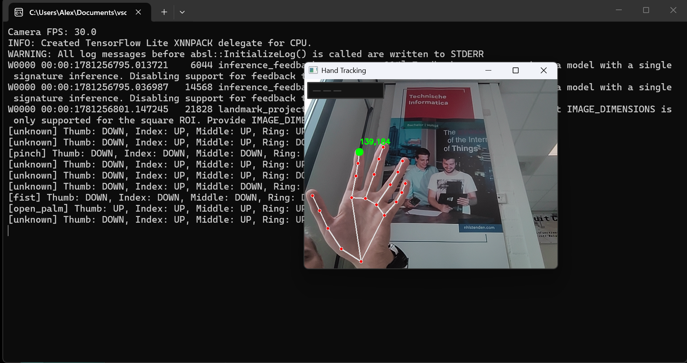

# Gesture Control Interface using Computer Vision

A computer vision project that enables interaction with a computer using hand gestures captured from a webcam.

The system detects and tracks hand landmarks in real time and serves as a foundation for gesture-based control interfaces.

## Features

- Real-time hand detection
- Hand landmark tracking
- Multi-hand support
- Visual feedback using landmarks

## Technologies

- Python 3.12.XX
- OpenCV
- MediaPipe

## Installation

Clone the repository:

```bash
git clone https://github.com/waseston/Pet-project.git

cd hand_controler

```

## Install dependencies

Depending on your system's OS, you need to install the appropriate dependencies.

 - Windows:

```python

pip install -r requirements_win.txt

```

 - MacOS(intel)

 ```python

pip install -r requirements_mac.txt

```

## Usage

Run the main script:

```pyhon

python main.py

```
The webcam will open and the system will start detecting hands.

## Screenshot of programm 



## Project Structure

```bash

hand_controller
│
├── tracking
│   └── hand_tracker.py
│   └── gesture_controler.py
├── vision
│   └── camera.py
│   └── render.py
├── main.py
├── app.py
└── README.md

```